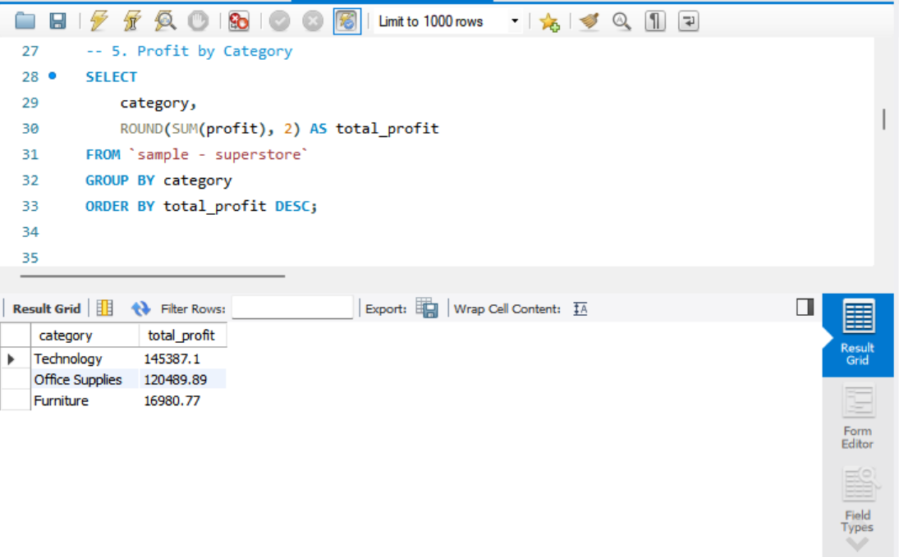
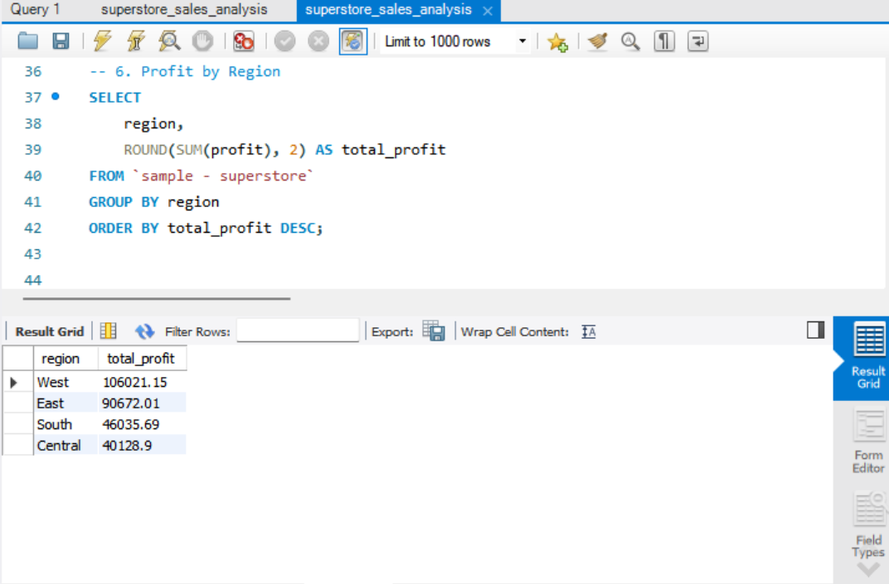
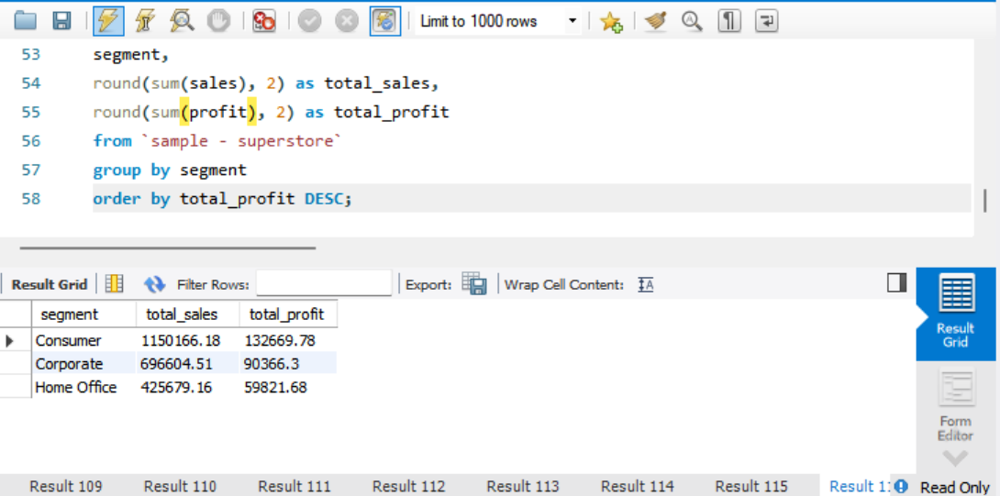
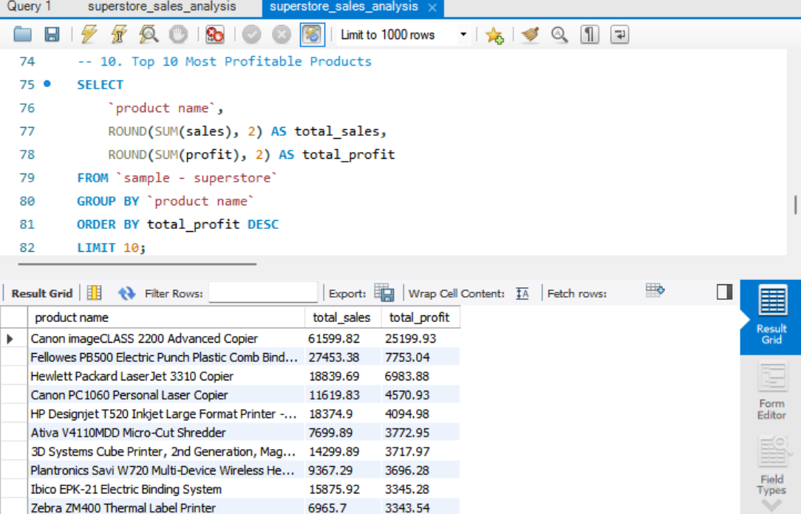
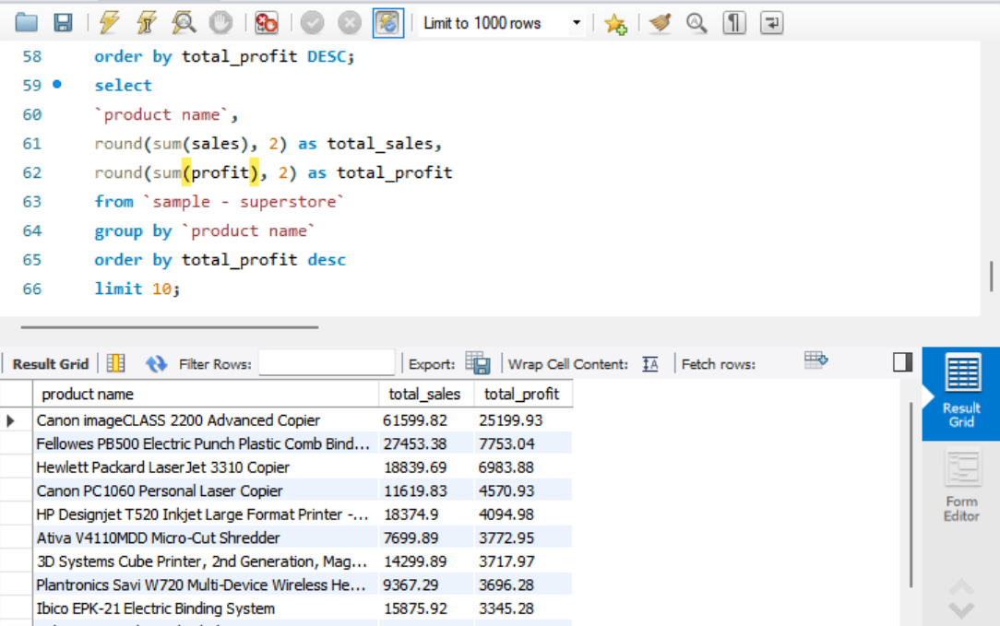
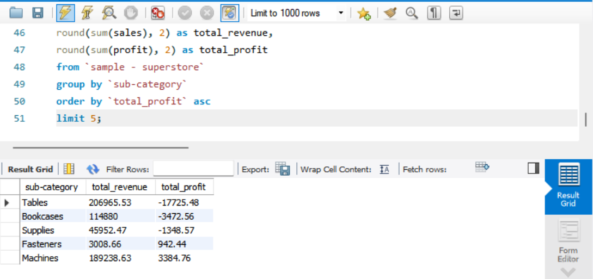

# Superstore Sales Analysis

## Project Overview

This project analyzes Superstore sales data to identify trends in sales performance, profitability, customer segments, product performance, and regional performance.

The goal of the analysis is to use SQL to transform raw sales data into actionable business insights that could support decisions around product strategy, customer segmentation, and profitability.

## Business Questions

This analysis answers the following business questions:

1. Which products generate the most sales?
2. Which products generate the most profit?
3. Which products and subcategories have the lowest profitability?
4. Which customer segments generate the most sales and profit?
5. Which regions perform best based on sales and profitability?
6. Which product categories contribute the most revenue and profit?
7. What areas of the business may require further investigation?

## Tools & Technologies

- SQL
- MySQL
- GitHub
- MySQL Workbench

## Key Analysis

### Product Performance

Analyzed the top-performing products by sales and profit while also identifying products with the lowest profitability.

### Customer Segment Performance

Compared sales and profit across the Consumer, Corporate, and Home Office segments.

### Regional Performance

Compared sales and profitability across geographic regions to identify stronger and weaker areas of the business.

### Category Performance

Analyzed sales and profitability across major product categories.

### Subcategory Profitability

Identified subcategories generating the lowest profits to highlight potential areas for further business investigation.

## Key Business Insights

- The Consumer segment generated the highest sales and profit among the three customer segments analyzed.
- Consumer sales totaled approximately $1.15 million with approximately $132.7K in profit.
- Corporate sales totaled approximately $696.6K with approximately $90.4K in profit.
- Home Office generated approximately $425.7K in sales and approximately $59.8K in profit.
- The analysis also identified individual products and subcategories generating significant negative profit, highlighting potential opportunities for pricing, cost, or product strategy review.

## Screenshots

### Sales & Profit by Category

### Sales & Profit by Region

### Sales & Profit by Customer Segment

### Top 10 Products by Sales

### Top 10 Products by Profit

### Lowest Profit Subcategories

## SQL Techniques Demonstrated

- SELECT statements
- Aggregate functions
- SUM()
- ROUND()
- GROUP BY
- ORDER BY
- LIMIT
- Aliasing
- Data aggregation
- Business-oriented analysis

## Project Takeaway

This project demonstrates the use of SQL to analyze business data and translate query results into meaningful insights. The analysis focuses not only on revenue generation but also on profitability, customer segments, products, and areas of potential business risk.
